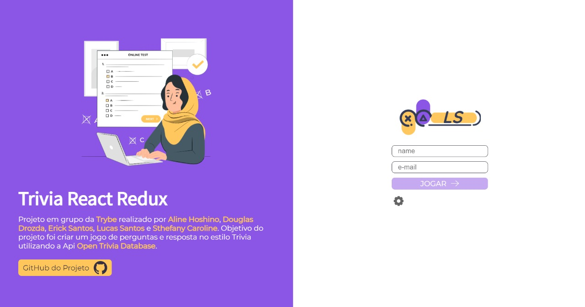

## Trivia Game made with React

This was a group project developed in the [Software Development Course at Trybe](https://www.betrybe.com/formacao-desenvolvimento-web). In this project we were able to catch questions and their answers from the [Open Trivia Database API](https://www.betrybe.com/formacao-desenvolvimento-web) and use React to show our users their feedback and ranking after they played the game. We also used [Gravatar](https://pt.gravatar.com/) to show the users their photo while they are playing.
This project had the contribution of:
[Erick Santos (me)](https://www.linkedin.com/in/erickosantos/)
[Aline Hoshino](https://www.linkedin.com/in/alinehoshino/)
[Douglas Drozda](https://www.linkedin.com/in/douglasdrozda/)
[Lucas Santos](https://www.linkedin.com/in/lucas-santos-dev/)
[Sthephany Caroline](https://www.linkedin.com/in/sthefany-caroline/)

To access the deployed project: https://trivia-react.vercel.app/

### Images from the project




### How to download and run the project code

First of all you need to download the project files, you can do this usin git.

``` git clone git@github.com:erick-ol/react-trivia.git ```

After you clone the repository you need to enter the folder that contains the project you just downloaded and install all the dependencies of this application.

``` npm install ```

Then you just need to start your application to have fun and learn a lot more.

``` npm start ```
